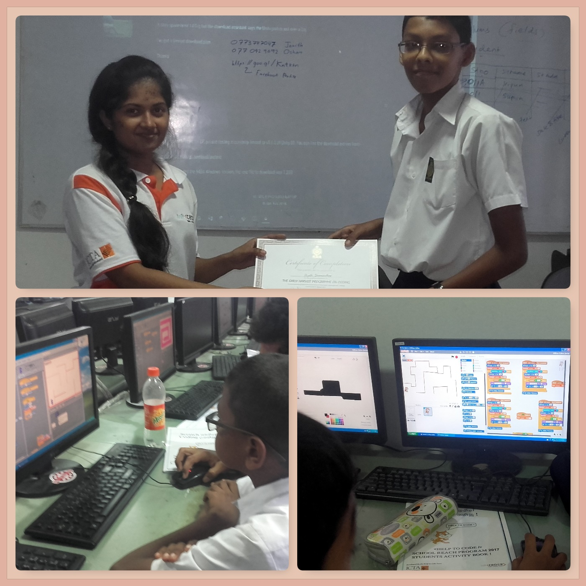

# ICTA-Help-to-Code

This was a Scratch based course of six days for school children. ICTA had selected some of the schools in Colombo and Gampaha District. 
I participated to the volunteering session which was held in Royal college colombo. And there were about 25 children from grade 6,7,8 classes to learn programming basics. We gave them basic knowledge on programming and tought them scratch in depth. 

